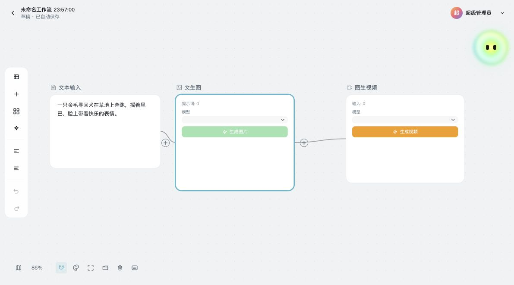

<h1 align="center">✦ Kina</h1>

<hr>

<p align="center">
  <code>AI 创作工作台 · 多模态内容生产</code>
</p>

<p align="center">
  <strong>从一个想法出发，在同一个工作台完成规划、生成、编排与沉淀。</strong>
</p>

<p align="center">
  用 Agent 组织创作意图，连接图片、视频、无限画布与可视化工作流，让创作过程可执行、可追踪、可恢复、可复用。
</p>

<p align="center">
  
  
  
  
  
  
</p>

<p align="center">
  🤖 Agent 创作 · 🎨 图片生成 · 🎬 视频生成 · ∞ 无限画布 · 🔗 工作流复用
</p>

<p align="center">
  <a href="#什么是-kina">这是什么</a>
  ·
  <a href="#六个核心模块">功能</a>
  ·
  <a href="#快速开始">安装</a>
  ·
  <a href="#技术栈">技术栈</a>
  ·
  <a href="#安全与使用边界">使用边界</a>
  ·
  <a href="docs/KINA_PRD_V1.0.md">PRD</a>
</p>

<p align="center">
  
</p>

<p align="center">
  <sub>Kina 无限画布预览 · 文本输入、图片生成与视频生成节点编排</sub>
</p>

## 什么是 Kina？

Kina 是一个面向内容创作者、营销运营和小型创意团队的 AI 创作与运营平台原型。它将 Agent 对话、图片与视频生成、无限画布、可视化工作流、视频编辑和资产管理放进同一套创作链路，减少多工具切换带来的上下文丢失、参数难复用和长任务状态不可追踪问题。

Kina 同时提供模型、厂商、技能、存储、用户、会员积分和生成记录等运营后台能力。当上游模型或可选基础设施不可用时，系统会按已实现的任务状态、失败重试和服务重启恢复机制保留可观测的处理路径。

## 六个核心模块

| 模块 | 用户价值 | 当前能力 |
| --- | --- | --- |
| Agent 与技能 | 将自然语言想法转为可执行创作任务 | 意图澄清、技能选择、分阶段执行、结果回传 |
| 多模态生成 | 在同一入口完成图片与视频创作 | 图片生成、图片编辑、视频生成、参考素材输入 |
| 无限画布 | 在空间中组织素材、想法与生成结果 | 自由布局、节点连线、撤销重做、自动保存、导入导出 |
| 可视化工作流 | 将单次创作方法沉淀为可复用流程 | DAG 校验、拓扑执行、版本快照、刷新恢复、失败节点重试 |
| 视频编辑与资产 | 让生成内容能继续编辑并统一沉淀 | 媒体资产、项目素材、视频工程与存储管理 |
| 运营与治理 | 统一管理模型、用户、成本和风险 | 厂商配置、模型管理、生成记录、会员积分、审计与 Redis 监控 |

## 创作主链路

```text
创意输入 → Agent/技能规划 → 多模态生成
→ 画布组织 → 工作流复用 → 视频编辑 → 资产沉淀
```

## 安全与使用边界

本项目（Kina）是一个包含 Vue 3 创作端、Node/Prisma 服务端与运营后台的 **AI 创作平台原型**，用于展示 Agent、多模态生成、无限画布、可视化工作流及平台运营能力的技术实现。

1. **非官方产品**：本项目**并非**任何商业 AI 平台（包括但不限于即梦 AI、字节跳动旗下产品）的官方软件、破解版或衍生品。项目名称、图标及视觉设计均与上述平台无关。
2. **仅供学习与研究**：本项目代码以 MIT 协议开源，**仅限于技术学习、研究与个人非商业用途**。开发者不鼓励、不支持任何侵犯第三方知识产权的行为。
3. **版权与风险提示**：本项目的界面布局、交互逻辑可能涉及第三方（如即梦 AI）的独创性设计。**任何个人或组织若将本项目用于商业目的，须自行承担因界面相似性引发的全部版权侵权、不正当竞争等法律风险与后果**。项目原作者不承担任何连带或赔偿责任。
4. **使用即同意**：一旦您使用、复制、修改或分发本项目代码，即表示您已阅读并同意本声明的所有条款。若您不同意，请立即停止使用并删除本项目。

> 当前仓库处于功能原型与工程验证阶段。仓库内的功能、数据结构和自动化检查不代表真实 DAU、留存、付费转化或生产规模结论；模型效果、生成成本和线上稳定性仍需结合真实厂商与运行数据验证。

## 📚 项目文档

- [Kina 产品需求文档（PRD V1.0）](docs/KINA_PRD_V1.0.md)
- [无限画布与工作流功能状态](docs/CANVAS_WORKFLOW_STATUS.md)
- [智能画布本地参考页规格](docs/CANVAS_REFERENCE_SPEC.md)
- [2026-08-07 发布说明](docs/RELEASE_NOTES_2026-08-07.md)

## 🧭 产品组成

### 前台创作端

- 对话式 AI 创作入口
- 多创作模式切换：`Agent / 图片生成 / 视频生成`
- 会话列表、会话切换、重命名、删除
- 生成过程状态展示与结果流转（基于 SSE 实时推送）
- 无限画布、创作区
- 可视化工作流：节点拖拽、连线、撤销/重做、模板插入、版本回滚

### 后台运营端

- 仪表盘与运营工作台
- 资源管理（全站资源、服务端分页、筛选、批量操作）
- 生成记录管理（任务状态、模型、用户维度筛选）
- 会话管理、会话配置（生成进度文案、入口展示、列表字段）
- 技能管理、厂商配置、模型管理、对象存储配置
- 用户管理、营销中心（会员/积分/卡密/奖励）、系统设置
- 登录方式配置（验证码 / OAuth）
- Redis 健康监控、主题色配置

### 服务端能力

- 独立 Node 服务承载 `/api/...`（基于策略模式的轻量分发，未引入 Express/Koa）
- Prisma 管理数据库结构与迁移（50+ 数据模型）
- 生成任务统一调度（图片 / 视频 / Agent 对话 / Agent 工作台 / 深度研究五类策略）
- AI 网关统一转发上游 OpenAI 兼容厂商
- 系统设置、会话配置、积分/营销/资源等数据接口
- 本地存储与 S3 兼容对象存储双通道
- 任务级 SSE 事件总线（本地 EventEmitter + Redis Pub/Sub 双通道）

## ✨ 当前已实现的核心能力

### 创作与会话

- 多模式创作入口与模式配置
- 会话列表与真正可用的会话交互
- 会话管理后台
- 会话配置中心
- 生成进度文案配置与前台联动
- 任务级 SSE 流式订阅（`connected / snapshot / progress / content_delta / agent_event / completed / failed / stopped`）

### 可视化工作流

- 基于 Vue Flow 的画布交互（节点 / 边 / 视口 / 撤销重做 / 小地图）
- 6 类自定义节点：`text / imageConfig / image / videoConfig / video / llmConfig`
- 3 类自定义边：`imageRole / promptOrder / imageOrder`
- 4 类内置工作流模板：`text_to_image / text_to_image_to_video / storyboard / multi_angle_storyboard`
- 工作流定义入库与版本快照（`WorkflowDefinition + WorkflowDefinitionVersion`）
- 历史版本回滚会创建新草稿版本，不覆盖既有快照
- 整图运行前校验依赖图，由服务端按拓扑顺序执行 LLM / 图片 / 视频生成节点
- 页面关闭后服务端任务继续运行；重新进入可恢复运行状态和结果，失败或中断后可从失败节点重试
- 节点生成统一通过任务事件订阅获取进度

无限画布与工作流的当前完成度、运行边界和验收步骤见 [功能状态说明](docs/CANVAS_WORKFLOW_STATUS.md)。

### 管理后台

- 用户管理、资源管理
- 会话管理、会话配置
- 生成记录管理
- 技能管理、厂商配置、存储配置
- 营销中心、系统设置、Redis 监控、主题色配置

### 基础设施

- Prisma 数据库模型与迁移（当前 Schema 使用 PostgreSQL）
- 本地上传与对象存储上传（含路径穿越保护）
- 管理员权限路由守卫
- 登录方式配置与后台管理（验证码 + 多平台 OAuth）
- 任务限流（固定窗口）与并发控制（用户 / 厂商 / 技能三维）
- Docker 单容器统一部署链路

## 快速开始

### 环境要求

- `Node.js >= 20.19.0`
- `pnpm 11`（仓库声明版本：`pnpm@11.11.0`）
- `PostgreSQL 17+`（Prisma 连接数据库）
- `Redis`（可选；用于任务运行态、缓存、跨实例事件广播）

### 安装依赖

```bash
pnpm install
```

### 本地开发

```bash
pnpm dev
```

该命令会同时启动：

- 前端开发服务：`http://localhost:5010`
- 本地后端服务：`http://localhost:5409`

### Redis 可选配置

如果你希望启用任务运行态共享、配置缓存和跨实例事件广播，可以补充以下环境变量：

```env
REDIS_ENABLED=true
REDIS_HOST=127.0.0.1
REDIS_PORT=6379
REDIS_PASSWORD=
REDIS_DATABASE=1
REDIS_PREFIX=canana
REDIS_ENV=development
REDIS_URL=
REDIS_DEFAULT_TTL_SECONDS=60
REDIS_TASK_RUNTIME_TTL_SECONDS=1800
REDIS_TASK_SNAPSHOT_TTL_SECONDS=1800
REDIS_TASK_ABORT_TTL_SECONDS=300
REDIS_TASK_LOCK_TTL_MS=30000
REDIS_TASK_IDEMPOTENCY_TTL_SECONDS=600
REDIS_TASK_CONCURRENCY_TTL_SECONDS=1800
REDIS_RATE_LIMIT_WINDOW_SECONDS=60
REDIS_TASK_SUBMIT_RATE_LIMIT=6
REDIS_TASK_USER_CONCURRENCY_LIMIT=3
REDIS_TASK_PROVIDER_CONCURRENCY_LIMIT=8
REDIS_TASK_SKILL_CONCURRENCY_LIMIT=4
REDIS_AUTH_VERIFICATION_RATE_LIMIT=5
REDIS_AUTH_LOGIN_RATE_LIMIT=10
```

说明：

- `REDIS_HOST`、`REDIS_PORT`、`REDIS_PASSWORD`、`REDIS_DATABASE` 为推荐写法
- `REDIS_URL` 为兼容保留字段，不填时会根据以上拆分字段自动拼接
- `REDIS_PREFIX`、`REDIS_ENV` 以及各类 TTL 配置均为可选项，不配置会使用服务端默认值
当前实现支持“无 Redis 降级运行”：

- 未配置 Redis：继续使用本机内存态，不影响现有开发流程
- 已配置 Redis：额外启用共享任务运行态、SSE 事件广播和运行时缓存

后台可通过以下接口快速验证 Redis 是否联通：

```text
GET /api/system-config/admin/redis-health
```

该接口需要管理员登录态。

### 生成 Prisma Client

```bash
pnpm prisma:generate
```

### 开发库迁移

```bash
pnpm prisma:migrate:dev
```

### 类型检查

```bash
pnpm type-check
```

### 前端构建

```bash
pnpm build
```

### 生产启动

```bash
pnpm start
```

生产启动流程会自动处理：

1. `prisma migrate deploy`
2. 启动服务端
3. 由服务端统一托管前端静态资源与 API

## 🖼️ 图片生成与编辑链路

当前项目已经将“纯文生图”和“带参考图的图片编辑”拆成两条长期可维护的正式链路。

### 后台供应商配置

后台 `厂商配置` 页面现在支持以下图片相关端点：

- `图片生成端点`：默认 `/images/generations`
- `图片编辑端点`：默认 `/images/edits`

- 文生图：`/v1/images/generations`
- 图编辑：`/v1/images/edits`

### 生成页行为

- 没有参考图时：走标准图片生成接口
- 有参考图时：自动切换到图片编辑接口
- 服务端生成任务会按 `requestMode` 分流，不再把参考图继续塞进旧 JSON 请求体


其中图片编辑请求会发送如下核心字段：

- `model`
- `prompt`
- `n`
- `size`（有值时发送）
- 一个或多个 `image`

## 🎬 视频生成与参考图链路

视频任务支持文生视频、图生视频和工作流视频节点。参考图会先被规范化为服务端可持久访问的资源，再按不同厂商的接口协议发送：

- `auto`：默认策略；OpenAI 官方端点使用 multipart 文件，其余厂商默认使用 HTTPS URL
- `url`：向上游发送公网 HTTPS 图片 URL
- `file`：由服务端读取参考图并以 multipart 文件上传

管理员可在 `厂商配置` 中选择参考图传输方式，也可通过环境变量配置：

```env
# 站内 /uploads 图片转换为厂商可访问 URL 时使用；必须为公网 HTTPS 地址
VIDEO_REFERENCE_PUBLIC_BASE_URL=https://your-domain.com

# 可选：url 或 file；省略时自动判断
VIDEO_PROVIDER_REFERENCE_TRANSPORT=url
```

注意：

- URL 模式不接受 localhost、内网、保留地址或携带凭据的 URL
- 使用公网对象存储且上传结果已包含公网地址时，可不配置 `VIDEO_REFERENCE_PUBLIC_BASE_URL`
- 页面停止任务会终止本地请求和轮询，但第三方视频任务是否真正取消取决于厂商协议
- 视频任务的参考素材数量、字段角色和格式仍以所选模型能力为准

## 🐳 Docker 部署

仓库已提供：

- `Dockerfile`
- `docker-compose.yml`

### 推荐最小环境变量

```env
APP_PORT=5409
VITE_API_BASE_URL=https://你的域名或接口地址
VIDEO_REFERENCE_PUBLIC_BASE_URL=https://你的域名或接口地址
STATIC_DIST_DIR=/app/dist
UPLOADS_DIR=/app/uploads
CORS_ALLOWED_ORIGINS=https://你的前端域名
SERVER_HOST=127.0.0.1
DATABASE_URL=postgresql://用户名:密码@数据库地址:5432/canvasmind
PROVIDER_CONFIG_SECRET=请替换成你自己的密钥
STORAGE_CONFIG_SECRET=
AUTH_LOGIN_CODE_EXPIRE_MINUTES=5
AUTH_SESSION_EXPIRE_DAYS=30
REDIS_ENABLED=true
REDIS_HOST=redis
REDIS_PORT=6379
REDIS_PASSWORD=
REDIS_DATABASE=1
REDIS_PREFIX=canana
REDIS_ENV=production
REDIS_URL=
```

### 启动方式

```bash
docker compose pull
docker compose up -d --force-recreate --remove-orphans
```

如果需要本机构建镜像：

```bash
docker build -t canana-vue:latest .
docker compose up -d --force-recreate --remove-orphans
```

## 🧩 常用脚本

```bash
pnpm dev
pnpm build
pnpm build:service
pnpm start
pnpm preview
pnpm type-check
pnpm test:scripts
pnpm prisma:generate
pnpm prisma:migrate:dev
pnpm prisma:migrate:deploy:local
pnpm prisma:migrate:deploy:prod
```

## 🗂️ 当前项目结构

```text
kina/
├── src/                              # Vue 3 前端
│   ├── api/                          # 前端 API 封装（含 admin/ai-gateway/storage/...）
│   ├── components/                   # 公共组件 + 业务组件
│   ├── composables/                  # 通用组合式函数（分页、画布、视口、拖拽等）
│   ├── config/                       # 模型与技能配置常量
│   ├── router/                       # 路由配置（含管理后台守卫）
│   ├── shared/                       # 前后端共享类型与协议
│   ├── stores/                       # 全局状态（轻量 Composable Store）
│   ├── styles/                       # 全局样式
│   ├── utils/                        # 通用工具（请求、SSE、错误处理）
│   └── views/
│       ├── generate/                 # 创作与生成页面
│       ├── workflow/                 # 可视化工作流（components/composables/config/api）
│       ├── infinite-canvas-replica/  # 无限画布入口与宿主集成
│       ├── agentic-assets-canvas/    # 画布 / 工作流项目工作台
│       ├── video-editor/             # 视频工程与编辑器
│       ├── home/                     # 首页
│       ├── account/                  # 账户中心
│       ├── publish/                  # 发布中心
│       ├── asset/                    # 资源管理
│       ├── install/                  # 系统初始化引导
│       ├── policies/                 # 政策协议页
│       └── admin/                    # 管理后台
│           ├── assets/               # 资源管理
│           ├── conversations/        # 会话管理 / 会话配置
│           ├── dashboard/            # 后台首页
│           ├── generations/          # 生成记录管理
│           ├── marketing/            # 营销中心
│           ├── providers/            # 厂商配置
│           ├── plugins/              # 画布插件管理
│           ├── redis/                # Redis 健康监控
│           ├── skills/               # 技能管理
│           ├── storage/              # 存储配置
│           ├── system/               # 系统设置
│           ├── theme/                # 主题色配置
│           └── users/                # 用户管理
├── src-infinite-canvas/               # React 无限画布工作台源码
├── server/                           # 独立 Node 后端（无 Express/Koa）
│   ├── ai-gateway/                   # AI 上游网关转发
│   ├── auth/                         # 验证码、管理员密码与 OAuth 认证
│   ├── admin-dashboard/              # 后台仪表盘接口
│   ├── admin-generation-sessions/    # 后台会话/生成接口
│   ├── admin-marketing/              # 营销中心后台接口
│   ├── admin-users/                  # 用户后台接口
│   ├── asset-items/                  # 资源中心接口
│   ├── canvas-plugins/               # 受信画布插件管理
│   ├── canvas-projects/              # 画布项目接口
│   ├── canvas-prompts/               # 画布提示词库与来源
│   ├── conversation-settings/        # 会话配置接口
│   ├── generation-records/           # 生成记录
│   ├── generation-sessions/          # 会话数据
│   ├── generation-tasks/             # 生成任务调度（核心，含 SSE 事件总线）
│   ├── marketing-center/             # 营销中心前台接口
│   ├── provider-config/              # 厂商配置
│   ├── research/                     # 深度研究执行链路
│   ├── skill-config/                 # 技能配置
│   ├── storage/                      # 上传服务
│   ├── storage-config/               # 对象存储配置
│   ├── system-config/                # 系统设置
│   ├── system-init/                  # 首次初始化
│   ├── video-projects/               # 视频工程接口
│   ├── workflow-definitions/         # 工作流定义与版本
│   ├── workflow-runs/                # 工作流运行与节点状态
│   ├── redis/                        # Redis 全套能力（缓存/锁/限流/Pub-Sub）
│   ├── db/                           # Prisma 客户端单例
│   └── shared/                       # 共享日志
├── prisma/
│   ├── schema.prisma                 # PostgreSQL 数据模型与枚举
│   └── migrations/                   # 数据库迁移
├── docs/                             # PRD、功能状态、规格与发布说明
├── scripts/                          # 构建、生产启动、类清理脚本
├── public/                           # 公共静态资源
├── uploads/                          # 本地上传根目录（运行时）
├── dist/                             # 前端构建产物
├── dist-service/                     # 后端独立打包产物
├── Dockerfile
├── docker-compose.yml
└── README.md
```

## 🧠 后台模块说明

### `仪表盘`

- 总览统计（用户、会话、生成、资源等）
- 最近若干天的逐日趋势统计
- 当前默认厂商概览

### `会话管理`

- 查看全站会话
- 服务端分页、筛选、详情抽屉
- 支持会话标题维护
- 会话记录明细联查

### `会话配置`

- 基础规则
- 列表展示字段
- 入口展示配置
- 管理策略
- 生成进度文案配置

### `生成记录管理`

- 任务状态、模型、用户维度筛选
- 服务端分页与详情联查

### `资源管理`

- 我的资源 / 全站资源切换
- 用户维度筛选
- 服务端分页
- 批量操作

### `系统设置`

- 站点信息
- 政策协议
- 登录方式管理

### `技能 / 厂商 / 存储`

- 技能启用、状态管理、提示词模板
- 厂商模型与服务配置（含图编辑端点）
- 对象存储配置与本地回退

### `Redis 监控 / 主题配置`

- Redis 健康状态、运行时配置查看
- 主题色与布局配置


## 🖼️ 存储与上传

### 本地上传

- 上传接口：`POST /api/storage/upload`
- 默认公开访问前缀：`/uploads/...`
- 默认目录：`uploads/`

### 对象存储

当前支持统一的 **S3 兼容对象存储**：

- 配置接口：`/api/storage/configs`
- 上传接口：`/api/storage/upload`
- 上传策略：**优先上传启用中的对象存储；未配置时自动回退本地存储**

对象存储配置项包括：

- 名称
- 编码
- Access Key
- Secret Key
- Endpoint
- Bucket
- 域名
- 区域
- 排序
- 描述
- 状态

## 🔐 登录与权限

后台路由已接入管理员权限控制：

- 普通用户不可访问 `/admin/...`
- 管理后台包含独立的访问拒绝页
- 登录方式支持验证码与 OAuth 配置

当前后台已提供登录方式管理能力：

- 手机验证码登录
- 邮箱验证码登录
- 微信 OAuth
- GitHub OAuth
- Google OAuth
- 自定义 OAuth

## 技术栈

### 前端

- `Vue 3`（主应用，`<script setup>` + Composition API）
- `React 19`（无限画布工作台）
- `Vue Router 4`
- `Vite 7`
- `TypeScript 5`
- `Element Plus`
- `Vue Flow`（`@vue-flow/core / background / minimap`）— 可视化工作流画布
- `Tailwind CSS 4`（通过 `@tailwindcss/vite`）

### 后端

- `Node.js >= 20.19.0`
- 原生 `node:http`（基于策略表的轻量路由分发）
- `Prisma 7` + `@prisma/adapter-pg`
- `PostgreSQL 17+`
- `ioredis`（可选，用于限流、锁、Pub/Sub、缓存）
- `@aws-sdk/client-s3`（S3 兼容对象存储）
- `tsx`（开发态热更新）+ `esbuild`（生产打包）

## 📄 License

MIT

## 🔗 相关链接

- [Vue 3 文档](https://vuejs.org/)
- [Vite 文档](https://vitejs.dev/)
- [Vue Flow 文档](https://vueflow.dev/)
- [Element Plus 文档](https://element-plus.org/)
- [Tailwind CSS 文档](https://tailwindcss.com/)
- [Prisma 文档](https://www.prisma.io/docs)
- [即梦AI](https://jimeng.jianying.com/) - 字节跳动AI创作平台
- [Dreamina](https://www.capcut.com/ai-tool/platform) - 剪映AI创作工具
---

**kina** - 让 AI 创作更简单 🎨✨
